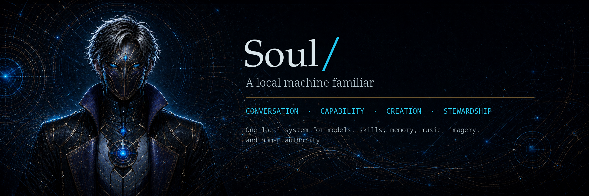

# Soul/

**Soul/**, also tracked as **soul-slash** or **Soul Slash**, is a local intelligence project for building a trustworthy assistant layer around small local models, deterministic skills, safety gates, recoverable workflows, and human-approved memory.

The model is not treated as the whole assistant. The model is the language organ. **Soul/** is the operating layer around it.

Soul/ is early experimental software. It is being built in layers so behavior can be inspected, tested, corrected, and approved before it becomes durable.

## What Soul/ is becoming

Soul/ is intended to grow into a local-first assistant environment with:

- local model runtime support through an OpenAI-compatible endpoint
- deterministic skills for actions that should not be left to model improvisation
- workflow orchestration for turning human intent into known, validated skill sequences
- safety gates that separate planning, selection, confirmation, execution, and verification
- recoverable operations where cleanup actions move to Trash first and can be restored
- human-approved memory where durable lessons and rules are staged before promotion
- optional cloud-assisted drafting/review for skill proposals, with human approval retained

## Design principles

- No green lights without gauges.
- Skills are preferred over improvisation.
- LLM output is advisory unless validated by deterministic code.
- Read-only planning comes before write actions.
- Write-capable workflows require explicit user confirmation.
- Trash is the terminal cleanup action for early cleanup workflows.
- Permanent deletion is not supported.
- Cloud LLM outputs are review artifacts, not repo mutations.
- Durable memory, rules, and skill updates are staged and human-reviewed before promotion.

## Architecture shape

```text
human request
-> intent routing
-> workflow selection
-> skill planning
-> human review / selection
-> explicit confirmation
-> deterministic execution
-> verification
-> optional restore
-> optional reflection
-> human-approved memory/rule promotion
```

The long-term goal is not a chatbot that guesses commands. The goal is a local operating layer that can translate human intent into verified, recoverable, approval-gated workflows.

## Requirements

Required:

- Ruby
- Git
- Make
- curl
- unzip
- either llama.cpp server or Ollama

Recommended:

- jq
- zip
- Python 3
- a GPU-supported local model runtime, if available

Soul/ is currently Linux-first.

See:

```text
docs/REQUIREMENTS.md
```

## Quick start

Clone the repository:

```bash
git clone https://github.com/Unhall0w3d/soul-slash.git
cd soul-slash
```

Check local tools:

```bash
make check
```

Detect installed runtimes, reachable endpoints, current `.env`, and local GGUF models:

```bash
make detect
```

Run guided setup:

```bash
make setup
```

Or choose a provider directly:

```bash
make setup-llamacpp
make setup-ollama
```

Show the selected local configuration:

```bash
make env-show
```

Test the configured runtime:

```bash
make test-runtime
```

Run basic Soul/ checks:

```bash
make test-soul
```

See the full setup guide:

```text
docs/GETTING_STARTED.md
```

## Runtime providers

Soul/ currently supports:

- llama.cpp server
- Ollama

Both are used at the OpenAI-compatible API layer.

See:

```text
docs/RUNTIME_PROVIDERS.md
```

## Common commands

List available skills:

```bash
ruby bin/soul skills
```

Check project/runtime health:

```bash
ruby bin/soul doctor
ruby bin/soul skill system.status
```

Classify a request:

```bash
ruby bin/soul intent "run a file cleanup in Downloads"
```

Run a workflow:

```bash
ruby bin/soul do "cleanup files in my downloads folder older than 30 days"
ruby bin/soul respond "move all"
ruby bin/soul respond "yeah, do it"
```

Stage and review reflection:

```bash
ruby bin/soul reflect last
ruby bin/soul reflection show latest
ruby bin/soul reflection approve latest --note "Approved after review"
```

For skill-specific commands, see:

```text
docs/SKILLS.md
```

## Skills

Skill usage has been moved out of the main README.

Start here:

```text
docs/SKILLS.md
```

Detailed skill docs live under:

```text
docs/skills/
```

## Cloud-assisted skill proposal flow

Soul/ can use configured cloud providers, currently with Mistral as the first serious manual-key provider, to draft and review skill proposal artifacts.

Cloud output remains review-only.

See:

```text
docs/skills/SKILL_BRIEF_DRAFT.md
docs/skills/SKILL_BRIEF_REVIEW.md
docs/soul/CLOUD_LLM_POLICY.md
docs/soul/SKILL_PROPOSAL_FORMAT.md
```

## Development pattern

Soul/ uses overlay-based development.

An overlay is a focused zip containing a small set of files to apply to the existing project tree. This keeps changes reviewable and avoids giant unexplained rewrites.

See:

```text
docs/OVERLAY_SYSTEM.md
docs/overlays/
docs/overlays/archive/
```

## Roadmap direction

Near-term:

- strengthen Downloads cleanup and restore regression testing
- improve workflow/session listing and pruning
- improve voice-friendly response rendering
- load approved memory/rules into prompts safely
- expand skill registry validation
- continue packaging changes as focused overlays

Later:

- web UI shell
- voice input and TTS output
- wake-word integration
- project-aware skills
- local document search
- optional vector memory
- broader workflow domains beyond Downloads cleanup

## Repository status

This repository is public for project tracking and transparency.

No open-source license has been selected yet. Public visibility does not automatically grant reuse, modification, or redistribution rights.

See:

```text
docs/LICENSING.md
```
