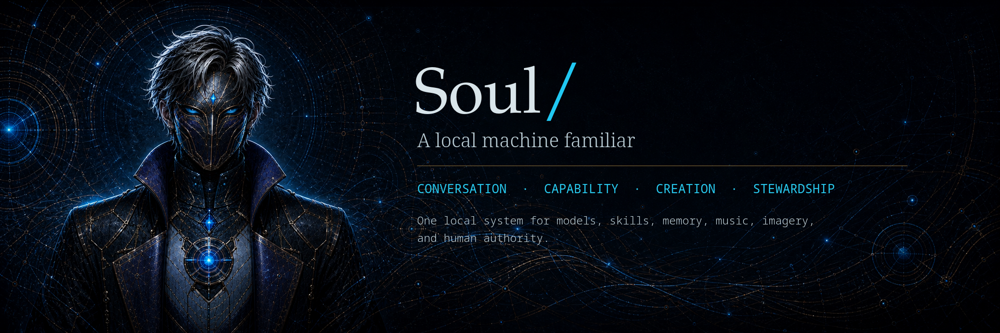

# Soul/

**Soul/**—also tracked as **soul-slash** or **Soul Slash**—is a local-first machine artificer built around local models, deterministic skills, persistent conversation, creative studios, inspectable memory, explicit authority, and recoverable workflows.

The model is not treated as the whole assistant. It supplies language and reasoning; Soul supplies continuity, capability boundaries, artifacts, orchestration, review gates, and a stable interface across models.

Soul/ is experimental Linux-first software. It is developed in reviewable slices so new behavior can be inspected, tested, corrected, and explicitly accepted before it becomes durable or production-capable.

Read the NOC Thoughts feature: [How Soul/ Turns an Idea Into a Song](https://nocthoughts.com/2026/07/24/how-soul-slash-turns-an-idea-into-a-song.html).

## What exists now

The authenticated dashboard provides:

- **Chat** — persistent transmissions, explicit local push-to-talk transcription, bounded per-message local speech, visible five-second Voice Presence follow-ups, deterministic voice-mediated screen requests, immediate message rendering, local-model responses, bounded skill routing, read-only Creative Studio archive awareness, picture and explicit one-shot screen understanding, memory, artifacts, workspace, inbox, system status, model runtime controls, and exact-gated Core switching;
- **Self Improvement** — Skill Studio, Self Assessment, and Self Augmentation behind one navigation group;
- **Creative Studios** — Music Studio, Visual Studio, and Mix Studio with local generation, evidence, revision, lineage, sequencing, and export flows;
- **Administration** — Project Timeline, Backup & Recovery, and Guided Maintenance with separate review gates for every mutation;
- **Review Center** — redacted pending-approval and recent bounded-execution evidence without granting approval authority.

The supported local runtime topology currently includes:

- **Soul Core** — Gemma 4 12B Instruct Q4_K_M through Ollama/Vulkan on AMD;
- **Soul-Lite Core** — Qwen3 8B Q4_K_M through llama.cpp/CUDA on NVIDIA, leaving AMD available;
- **Creative Core** — Qwen handles chat on NVIDIA while bounded music and visual runtimes use AMD on demand;
- **Free Core** — no chat or development model is loaded, and the Dashboard remains locked to Core selection;
- **Dev Core** — Qwen carries chat on NVIDIA while the reviewed GPT-OSS 20B development worker remains resident on AMD.

The internal IDs `daily`, `amd-free`, and `music` remain stable for local-state compatibility. GPT-OSS is local-first for Skill Studio implementation drafting and bounded development review; Mistral remains an explicit, disclosed fallback rather than a silent dependency.

The dashboard can run in the foreground for development or as an explicitly installed local user service. Optional Caddy-based HTTPS exposes one reviewed LAN endpoint while Soul itself remains loopback-bound.

Music Studio supports exact whole-second projects from 30 seconds through 5 minutes plus a fixed 10-minute option, FLAC/MP3 candidates, persistent generation jobs, vocal evidence, revision lineage, lawful reference profiles, reviewed still or generated-motion companions, finished-song export, and exact local YouTube upload packages. The accepted owner-authorized upload path can send one exact package through a foreground OAuth and confirmation gate; private is the default and publication remains a human decision. Visual Studio provides bounded local still generation, guided edits, image-to-video, native text-to-video, review, deletion, and exact binding to Music candidates. Long-form motion repeats one accepted short study. Mix Studio arranges checksum-verified finished stereo masters into an immutable EDL, prepares a portable editor handoff, creates a bounded private FLAC/MP3 listening candidate, preserves corrected human listening reviews, and can export only the latest exact `keep` review as a checksum-verified accepted-audio package. It does not master, publish, or assemble visuals.

For a concise implementation and boundary map, see [Current State](docs/CURRENT_STATE.md).

## Use the dashboard

These guides explain the product surfaces, intended workflows, and human gates:

| Surface | Purpose | Guide |
| --- | --- | --- |
| Chat + Creative Studios | Collaboratively gather creative briefs, generate candidates through exact actions, and return playable/viewable results to Chat | [Conversational Creative Workflows](docs/guides/CONVERSATIONAL_CREATIVE_WORKFLOWS.md) |
| Voice Input | Record one bounded local utterance for local transcription and automatic submission through ordinary Chat | [Voice Input](docs/guides/VOICE_INPUT.md) |
| Voice Output | Speak one eligible Soul response locally through an explicit bounded control | [Voice Output](docs/guides/VOICE_OUTPUT.md) |
| Voice Presence | Open a visible local “Hey Soul” wake window for bounded spoken turns | [Voice Presence](docs/guides/VOICE_PRESENCE.md) |
| Picture Understanding | Attach one local PNG or JPEG to Chat and ask Soul what it can observe | [Picture Understanding](docs/guides/PICTURE_UNDERSTANDING.md) |
| Knowledge Vault | Share a portable Markdown knowledge surface with Soul and optionally open it in Obsidian | [Knowledge Vault](docs/guides/KNOWLEDGE_VAULT.md) |
| Local Search | Search reviewed documentation, Knowledge Vault notes, and canonical Music/Visual briefs with source citations | [Local Project and Document Search](docs/guides/LOCAL_SEARCH.md) |
| Project Timeline | Share and explicitly maintain the owner-local implementation ledger through the Dashboard or Chat | [Project Timeline](docs/guides/PROJECT_TIMELINE.md) |
| Backup and Recovery | Run and verify the encrypted local snapshot workflow and stage restores without overwriting live state | [Backup and Recovery](docs/soul/BACKUP_AND_RECOVERY.md) |
| Guided Maintenance | Maintain trusted repositories and Flatpak, review AUR updates separately, and operate the distinct reboot/Hyprland restoration flow | [Guided Maintenance](docs/guides/GUIDED_MAINTENANCE.md) |
| Security Monitoring | Operate accepted Wazuh observability, selective ClamAV scanning, and privacy-filtered read-only Chat/Voice status | [Security Monitoring](docs/guides/SECURITY_MONITORING.md) |
| Crucible Fedora Guest | Add an optional off-device backup target and read-only DNF5 maintenance laboratory on Proxmox | [Crucible Fedora](docs/guides/CRUCIBLE_FEDORA.md) |
| Temper NixOS Guest | Prove declarative Nix flake updates, system generations, and bounded reboot behavior on Proxmox | [Guided Maintenance](docs/guides/GUIDED_MAINTENANCE.md#nixos-laboratory-target) |
| Invocation Guide | Inspect what Soul can do, required inputs, Core needs, outputs, and retained approval boundaries without invoking anything | [Invocation Guide](docs/guides/INVOCATION_GUIDE.md) |
| Cores | Understand Soul, Soul-Lite, Creative, Free, and Dev runtime arrangements and the optional Dev setup | [Soul Cores](docs/guides/CORES.md) |
| Soul Dev Worker | Delegate bounded evidence synthesis to local GPT-OSS while Codex retains every tool and authority decision | [Soul Dev Worker](docs/guides/DEV_WORKER.md) |
| Codex subagents | Understand native Spark, Luna, and Terra routing and evidence-based trust | [Codex Native Subagents](docs/guides/CODEX_SUBAGENTS.md) |
| Skill Studio | Move a bounded capability from proposal through Beta evidence to explicit production promotion | [Skill Studio](docs/guides/SKILL_STUDIO.md) |
| Self Assessment | Inspect host, runtime, capability, update, and storage evidence without mutating the machine | [Self Assessment](docs/guides/SELF_ASSESSMENT.md) |
| Self Augmentation | Prepare isolated architecture-level experiments when a skill is not sufficient | [Self Augmentation](docs/guides/SELF_AUGMENTATION.md) |
| Music Studio | Create, analyze, revise, review, finish, and package local compositions | [Music Studio](docs/guides/MUSIC_STUDIO.md) |
| Mix Studio | Arrange finished stereo masters into an immutable sequence and export a portable editor handoff | [Mix Studio](docs/guides/MIX_STUDIO.md) |
| YouTube Publication | Authorize one exact reviewed upload or synchronize reviewed NOC Thoughts description links through separate foreground human gates | [YouTube Publication](docs/guides/YOUTUBE_PUBLICATION.md) |
| Visual Studio | Generate, review, revise, and bind private local imagery or short motion scenes | [Visual Studio](docs/guides/VISUAL_STUDIO.md) |

## Design principles

- No green lights without gauges.
- Conversation is not a decorative wrapper around a command parser.
- Skills are preferred over improvisation when accuracy, state, privacy, or auditability matters.
- Model output is advisory unless deterministic code validates it.
- Read-only planning precedes write actions.
- Risky, destructive, privileged, durable, or production-changing operations require explicit human authority.
- Trash remains preferred for early filesystem cleanup; permanent deletion is limited to exact previewed scopes such as conversations and private studio projects.
- Passing tests is evidence, not approval.
- Cloud output remains a candidate artifact unless a reviewed workflow says otherwise.
- Durable memory, rules, skills, and core changes are staged and reviewed before promotion.
- Personality should feel present without obscuring truthful state, limitations, or provenance.

## Architecture

The conversational path is:

```text
human message
→ conversation and relevant memory
→ intent, capability, and policy interpretation
→ response, clarification, skill, research, or artifact plan
→ bounded execution when needed
→ evidence-aware response
→ session update
→ optional human-reviewed durable promotion
```

State-changing workflows retain a stricter boundary:

```text
plan
→ preview exact scope
→ explicit approval
→ execute within bounds
→ verify
→ record evidence
```

Creative workflows add candidate lineage rather than overwriting their source:

```text
brief
→ exact generation
→ candidate
→ machine evidence where useful
→ human review
→ keep, revise, reject, bind, or export
```

See [Architecture](docs/ARCHITECTURE.md), [Interaction Architecture](docs/INTERACTION_ARCHITECTURE.md), and [Milestones](docs/MILESTONES.md).

## Requirements

Required for the base project:

- Ruby
- Git
- Make
- curl
- unzip
- an OpenAI-compatible local runtime through llama.cpp or Ollama

Recommended:

- jq and zip
- Python 3
- a supported GPU runtime
- Caddy for the optional protected LAN deployment

Music and visual tooling is optional, hardware-dependent, separately configured
and installed, and never installed by the base setup without its own
confirmation gates. See [Getting Started](docs/GETTING_STARTED.md).

## Quick start

```bash
git clone https://github.com/Unhall0w3d/soul-slash.git
cd soul-slash
make check
make detect
make defaults-show
make setup
make test-runtime
make test-soul
make dashboard
```

Open `http://127.0.0.1:4567/`.

First-run access uses username `admin` and bootstrap password `soul123`. The bootstrap session cannot load private dashboard data; Soul requires a replacement password of 12–128 characters before entry. Sign-ups and additional accounts are unavailable.

If the local administrator password is lost, stop the dashboard and run:

```bash
make dashboard-reset-admin
```

This revokes active sessions and restores the mandatory password-change gate.

For a persistent local dashboard and protected LAN access, follow the preview-first service and Caddy instructions in [Local systemd and HTTPS deployment](docs/soul/LOCAL_SYSTEMD_HTTPS_DEPLOYMENT.md). No service, listener, firewall rule, certificate trust, or LAN exposure is installed automatically after clone.

## Common commands

```bash
# Terminal conversation
ruby bin/soul chat
ruby bin/soul chat "inspect this machine"

# Capability and health inventory
ruby bin/soul skills
ruby bin/soul doctor
ruby bin/soul skill system.status

# Bounded assessments
ruby bin/soul assess environment
ruby bin/soul assess environment --updates
ruby bin/soul assess models
ruby bin/soul assess capabilities

# Dashboard
make dashboard
make dashboard-service-status

# Configuration
make env-show
make test-runtime
make test-soul
```

Configuration precedence is:

```text
CLI override
→ process environment
→ ignored local .env
→ tracked safe default
```

The Makefile defaults to the currently reviewed Gemma/Qwen/ACE-Step/FLUX/Wan
stack. To retain machine-local model substitutions, copy
`config/model_overrides.example.mk` to ignored `Makefile.local`, or pass the
same variables for one invocation. Creative model substitutions use complete
reviewed manifests—not unverified loose filenames—so repository revision,
filename, byte size, SHA-256, and runtime bounds remain coupled.

The public repository must not contain operator-specific credentials, addresses, hostnames, model paths, private memory, or generated project data.

## Skills, augmentation, and cloud assistance

Production skills are deterministic bounded capabilities. Beta candidates remain isolated and Operator-invoked until exact tested promotion. Self Augmentation is a separate lane for core architecture changes and cannot merge or deploy its own candidates.

Optional cloud providers may help draft, synthesize, or critique review artifacts. Cloud output cannot decide safety, authority, memory promotion, production promotion, or merge readiness, and it must not receive secrets or private memory.

See:

- [Skills](docs/SKILLS.md)
- [Cloud LLM policy](docs/soul/CLOUD_LLM_POLICY.md)
- [Human review gate](docs/soul/HUMAN_REVIEW_GATE.md)
- [Codex handoff contract](docs/CODEX_HANDOFF_CONTRACT.md)

## Development and historical evidence

Current work uses reviewed branches, deterministic verifiers, human review artifacts, and bounded implementation briefs. The repository also retains historical phase, overlay, and assessment documents as engineering evidence. Those records describe how Soul arrived here; the README, current-state map, architecture, and operator guides describe how it works now.

See [Repository Map](docs/REPOSITORY_MAP.md) and [Roadmap](docs/ROADMAP.md).

## Repository status

This repository is public for project tracking and transparency.

No open-source license has been selected. Public visibility does not automatically grant reuse, modification, or redistribution rights. See [Licensing](docs/LICENSING.md).
